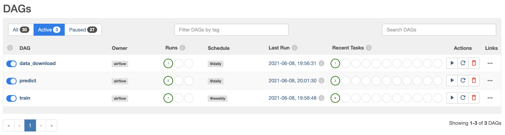
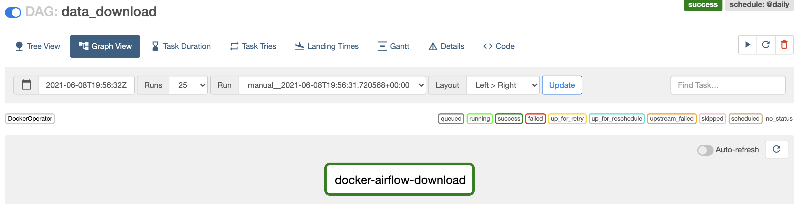
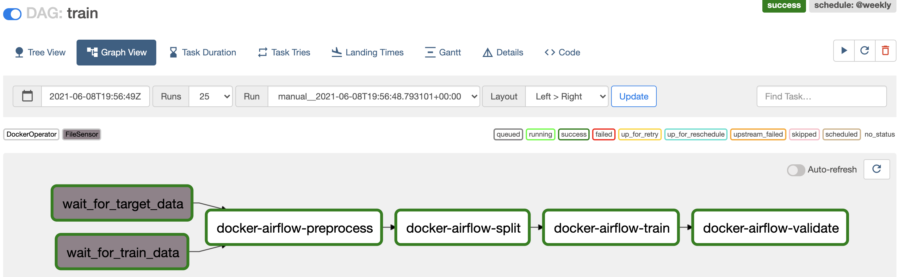
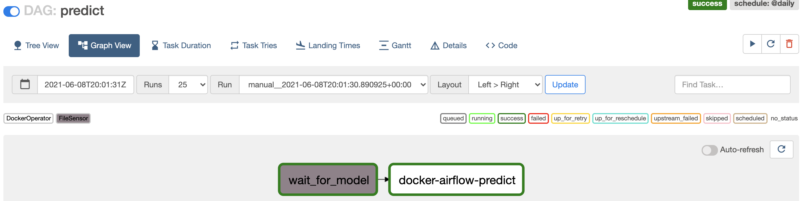

#### Запуск AirFlow:
```
docker-compose up --build
```

#### Запуса тестов:
```
pytest -v tests/
```
#### Скриншоты Airflow:

Список DAG:

Генерация данных:

Тренировка:

Прогноз:



#### Самооценка:
1. DONE (5 баллов) Реализуйте dag, который генерирует данные для обучения модели (генерируйте данные, можете использовать как генератор синтетики из первой дз, так и что-то из датасетов sklearn), вам важно проэмулировать ситуации постоянно поступающих данных
    - записывайте данные в /data/raw/{{ ds }}/data.csv, /data/raw/{{ ds }}/target.csv
  
2. DONE (10 баллов) Реализуйте dag, который обучает модель еженедельно, используя данные за текущий день. В вашем пайплайне должно быть как минимум 4 стадии, но дайте волю своей фантазии=)
    - подготовить данные для обучения(например, считать из /data/raw/{{ ds }} и положить /data/processed/{{ ds }}/train_data.csv)
    - расплитить их на train/val
    - обучить модель на train (сохранить в /data/models/{{ ds }} 
    - провалидировать модель на val (сохранить метрики к модельке)
  
3. DONE Реализуйте dag, который использует модель ежедневно (5 баллов)
    - принимает на вход данные из пункта 1 (data.csv)
    - считывает путь до модельки из airflow variables(идея в том, что когда нам нравится другая модель и мы хотим ее на прод 
    - делает предсказание и записывает их в /data/predictions/{{ds }}/predictions.csv

    3а. DONE  Реализуйте сенсоры на то, что данные готовы для дагов тренировки и обучения (3 доп балла)

4. вы можете выбрать 2 пути для выполнения ДЗ. 
    - поставить все необходимые пакеты в образ с airflow и использовать bash operator, python operator (0 баллов)
    - использовать DockerOperator, тогда выполнение каждой из тасок должно запускаться в собственном контейнере
    -- 1 из дагов реализован с помощью DockerOperator (5 баллов)
    -- DONE все даги реализованы только с помощью DockerOperator (10 баллов) (пример https://github.com/made-ml-in-prod-2021/airflow-examples/blob/main/dags/11_docker.py).

5. DONE Протестируйте ваши даги (5 баллов) https://airflow.apache.org/docs/apache-airflow/stable/best-practices.html 
6. NOT В docker compose так же настройте поднятие mlflow и запишите туда параметры обучения, метрики и артефакт(модель) (5 доп баллов)
7. вместо пути в airflow variables  используйте апи Mlflow Model Registry (5 доп баллов)
Даг для инференса подхватывает последнюю продакшен модель. 
8. DONE Настройте alert в случае падения дага (3 доп. балла)
https://www.astronomer.io/guides/error-notifications-in-airflow
9. DONE традиционно, самооценка (1 балл)

ИТОГО: 42 балла